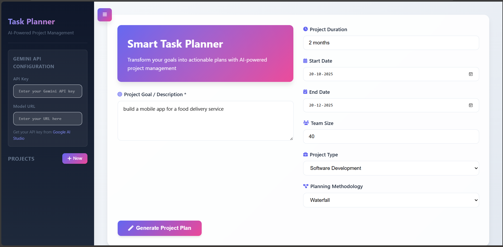
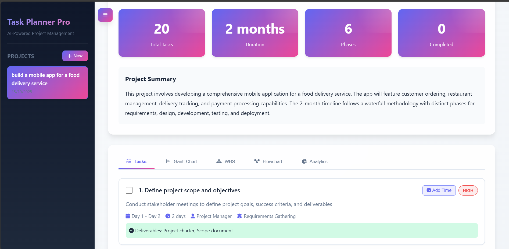
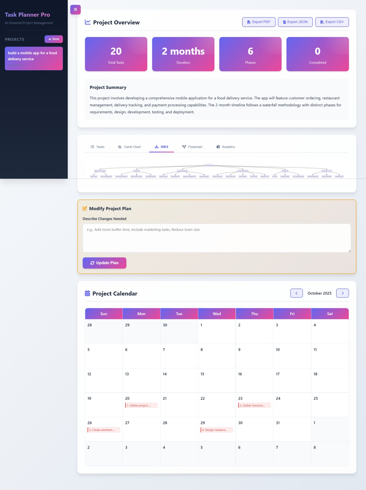
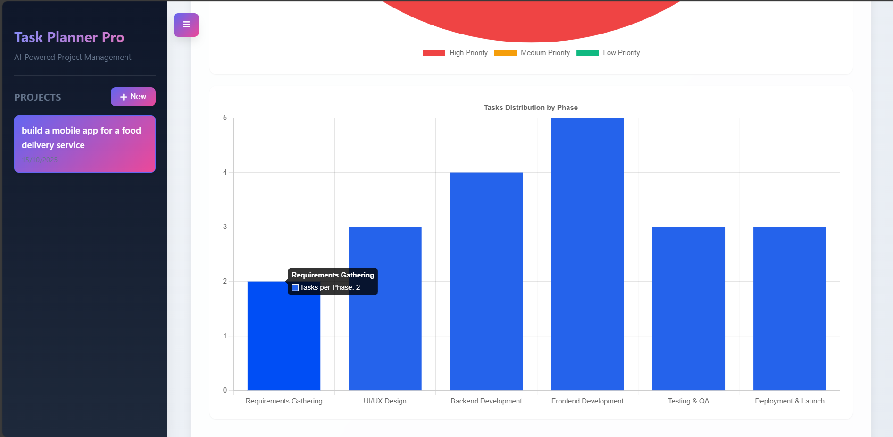

# Smart Task Planner 

An AI-powered project management system that transforms high-level goals into comprehensive, actionable project plans with intelligent task breakdown, dependency analysis, and visual timeline generation.

[](YOUR_VIDEO_LINK_HERE)

## Overview

Smart Task Planner leverages Google's Gemini AI to analyze project goals and automatically generate detailed project plans including task hierarchies, dependency chains, resource allocation, and multiple visualization formats (Gantt charts, WBS diagrams, and flowcharts).

### Key Features

- **AI-Driven Task Breakdown**: Automatically decomposes complex goals into manageable, prioritized tasks
- **Intelligent Dependency Mapping**: Identifies task relationships and creates logical execution sequences
- **Multi-Methodology Support**: Adaptable to Agile, Waterfall, Kanban, Lean, and Hybrid methodologies
- **Visual Project Analytics**: Interactive Gantt charts, Work Breakdown Structures, and flowcharts
- **Real-Time Modifications**: Iteratively refine plans through natural language instructions
- **Comprehensive Export Options**: Generate PDF reports, JSON data exports, and CSV task lists
- **ject Portfolio Management**: Persistent storage and management of multiple jects
- **Interactive Calendar View**: Visual task distribution across project timeline

## Screenshots








## Technical Architecture

### Technology Stack

**Frontend**
- Vanilla JavaScript (ES6+)
- HTML5 with semantic markup
- CSS3 with custom properties and advanced animations
- Chart.js for data visualization
- Mermaid.js for diagram generation

**AI Integration**
- Google Gemini API (generative-ai)
- Natural language processing for goal analysis
- Structured JSON output parsing

**Data Persistence**
- Browser LocalStorage for client-side data management
- JSON-based project serialization

### System Design

The application follows a single-page architecture with modular component design:

```
┌─────────────────────────────────────────────┐
│           User Interface Layer              │
│  (Input Forms, Visualizations, Controls)    │
└─────────────────┬───────────────────────────┘
                  │
┌─────────────────▼───────────────────────────┐
│        Application Logic Layer              │
│  (State Management, Event Handling)         │
└─────────────────┬───────────────────────────┘
                  │
┌─────────────────▼───────────────────────────┐
│          AI Processing Layer                │
│     (Prompt Engineering, Response Parse)    │
└─────────────────┬───────────────────────────┘
                  │
┌─────────────────▼───────────────────────────┐
│            Gemini API                       │
│   (Natural Language → Structured Plan)      │
└─────────────────────────────────────────────┘
```

## Installation & Setup

### Prerequisites

- Modern web browser (Chrome, Firefox, Safari, Edge)
- Google Gemini API key ([Get one here](https://aistudio.google.com/))

## Usage Guide

### Creating a Project Plan

1. **Define Project Parameters**
   - **Goal**: Describe your project objective clearly
   - **Duration**: Specify project timeframe
   - **Start/End Dates**: Set project boundaries
   - **Team Size**: Number of team members
   - **Project Type**: Select category (Software, Marketing, etc.)
   - **Methodology**: Choose planning approach

2. **Generate Plan**
   The AI analyzes your inputs and generates:
   - Comprehensive project summary
   - Phase breakdown with descriptions
   - Detailed task list with dependencies
   - Priority assignments
   - Resource allocations
   - Milestone definitions

3. **Modify Existing Plans**
   Use natural language to request changes:
   - "Add 2 weeks buffer time"
   - "Include marketing activities"
   - "Reassign testing tasks to QA team"

### Understanding AI Outputs

**Task Properties**
- `id`: Unique task identifier
- `title`: Task name
- `description`: Detailed task description
- `phase`: Project phase assignment
- `duration`: Estimated time requirement
- `dependencies`: Prerequisite task IDs
- `priority`: High/Medium/Low classification
- `assignedTo`: Role or team member
- `resources`: Required tools/assets
- `deliverables`: Expected outputs

**Dependency Resolution**
The system automatically:
- Identifies logical task sequences
- Prevents circular dependencies
- Calculates critical path
- Suggests parallel execution opportunities

## API Integration

### Gemini API Request Format

```javascript
{
  "contents": [{
    "parts": [{
      "text": "Structured prompt with project details"
    }]
  }],
  "generationConfig": {
    "temperature": 0.7,
    "topK": 40,
    "topP": 0.95,
    "maxOutputTokens": 8192
  }
}
```

### Expected Response Structure

```json
{
  "projectSummary": "Executive overview",
  "totalDuration": "Project timeframe",
  "phases": [
    {
      "name": "Phase name",
      "duration": "Phase length",
      "description": "Phase details"
    }
  ],
  "tasks": [
    {
      "id": 1,
      "title": "Task name",
      "description": "Task details",
      "priority": "high|medium|low",
      "dependencies": [2, 3],
      "...": "Additional properties"
    }
  ],
  "milestones": [...],
  "mermaidGantt": "Gantt chart syntax",
  "mermaidWBS": "WBS diagram syntax",
  "mermaidFlowchart": "Flowchart syntax"
}
```

## Prompt Engineering Strategy

The application uses structured prompting to ensure reliable AI outputs:

1. **Context Setting**: Establishes AI role as expert project manager
2. **Input Specification**: Clearly defines all project parameters
3. **Output Constraints**: Enforces valid JSON format
4. **Structure Definition**: Provides exact schema requirements
5. **Error Handling**: Implements fallback mechanisms for parse failures

### Prompt Template

```
You are an expert project manager. Create a comprehensive project plan in VALID JSON format.

PROJECT DETAILS:
- Goal: [user input]
- Duration: [timeframe]
- Team Size: [number]
- Methodology: [approach]

REQUIRED JSON STRUCTURE:
{structured schema definition}

RESPONSE MUST BE VALID JSON ONLY
```

## Advanced Features

### Task Timeline Logic

The system implements intelligent timeline calculation:
- **Sequential Dependencies**: Tasks execute in order
- **Parallel Execution**: Independent tasks run concurrently
- **Buffer Time**: Automatic slack integration
- **Critical Path**: Identifies bottleneck sequences

### Visual Analytics

**Priority Distribution Chart**
- Pie chart showing task priority breakdown
- Helps identify workload balance

**Phase Distribution Chart**
- Bar chart of tasks per project phase
- Reveals resource allocation patterns

**Gantt Timeline**
- Horizontal bar chart of task schedules
- Dependency relationships visualized

### Export Capabilities

**PDF Export**
- Complete project documentation
- Includes all visualizations and tables
- Professional formatting

**JSON Export**
- Full data structure export
- Enables integration with external tools
- Machine-readable format

**CSV Export**
- Task list with all properties
- Compatible with Excel, Google Sheets
- Easy data manipulation

## Error Handling & Resilience

### Fallback Mechanisms

1. **JSON Parse Failures**: Automatic extraction and retry
2. **API Errors**: User-friendly error messages
3. **Missing Data**: Default value injection
4. **Network Issues**: Graceful degradation

### Data Validation

- Input sanitization before API calls
- Response structure verification
- Type checking and coercion
- Boundary condition handling

## Project Structure

```
smart-task-planner/
├── index.html          
├── style.css           
├── script.js           
├── README.md           
└── screenshots/        
    ├── dashboard.jpg
    ├── tasks.jpg
    ├── wbs.jpg
    └── analytics.jpg
```

## Performance Considerations

- **Client-side Processing**: No backend infrastructure required
- **Lazy Loading**: Diagrams render on-demand
- **Efficient Storage**: Compressed JSON in LocalStorage
- **Optimized Rendering**: Canvas-based visualizations

## Security Best Practices

- **API Key Storage**: Client-side storage (user responsibility)
- **Input Sanitization**: Prevents injection attacks
- **HTTPS Requirement**: Secure API communication
- **No Server Storage**: Enhanced privacy

## Acknowledgments

- Google Gemini API for AI capabilities
- Mermaid.js for diagram generation
- Chart.js for data visualization
- Font Awesome for iconography

## Contact

REGNO: 22BDS0342
NAME: M Thirunarayanan

---

**Built with AI-powered intelligence for modern project management**
